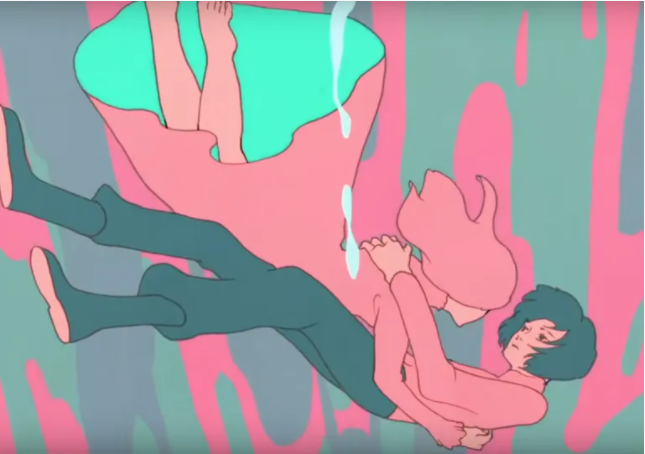

<html>

<head>

</head>

<body>
<!-- a big welcome in the top middle -->
 <h1 style="font-size:500%; text-align:center;">WELCOME</h1>
 

  
<!-- short intro -->

  My name is Henry Qi. This is my website.  
  I am a mechanical engineering student dipping my feet into HTML in an attempt to build my own website. I'm excited to see the variety of different setups and paths I can take using HTML.
  

  
 <pre style="background-color:WhiteSmoke;">
   Peter Piper picked a peck of pickled peppers.
    
   If Peter Piper picked a peck of pickled peppers,
    
   How many pecks of pickled pepper
    
   Did Peter Piper pick?
 </pre>
  
<!-- Testing hyperlinks (text & images) -->

My <b>favorite</b> song is 
<a href="https://www.youtube.com/watch?v=j1hft9Wjq9U&ab_channel=THEFIRSTTAKE">
Racing Into the Night by YOASOBI. </a> The angelic vocalist's name is Ikura.  
  
<h1 style="text-aligned:center"></h1>
  
 
The song tells the story <b>"The Seduction of Thanatos"</b>. A girl spends every night wanting to take her life to be with the reaper. But every time she is about to jump, her boyfriend is able to talk her out of it. The girl's love for the reaper devalues her own life, and the boy doesn't know what to do. He loves her dearly but can't live on seeing her so lifeless every day. One night, instead of talking her out of jumping, he stands next to her, holding hands. He couldn't live without her and would rather take his life to be with the girl he loves. She glanced over and him and smiled. The boy finally understood that she was his reaper as they leaped into the night together.

 

 

This is a pic of Sokka from Avatar the Last Airbender.

</body>

<html>
